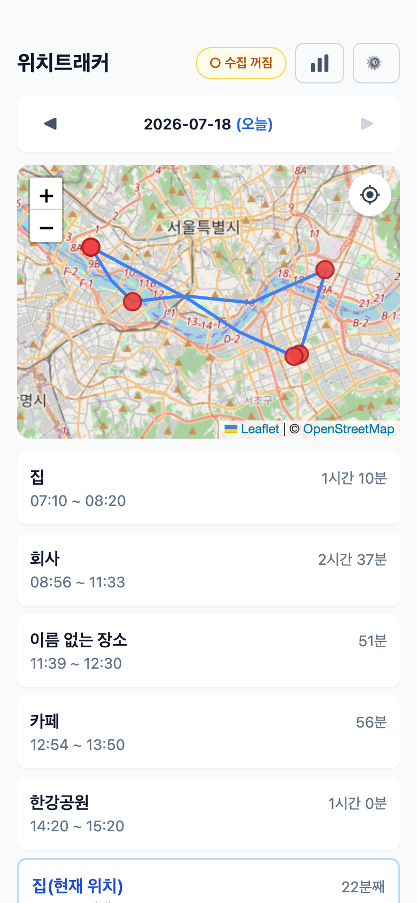
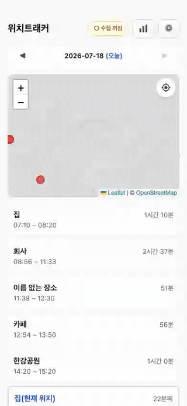
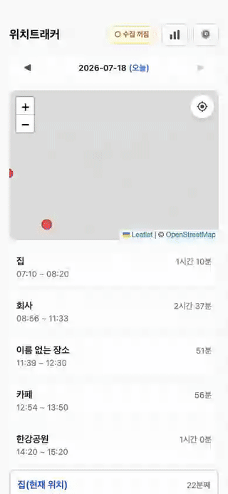
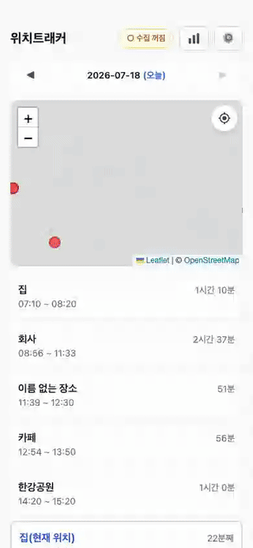

# 위치트래커

하루 동선을 자동으로 기록하는 개인용 안드로이드 앱. 구글맵 타임라인처럼 어디에 얼마나 머물렀는지 보여주되, **모든 데이터는 내 폰에만 저장**된다(서버 전송 없음).

## 설치 (안드로이드)

1. [최신 릴리스](https://github.com/shininghyunho/location-tracker/releases/latest)에서 `.apk` 파일을 폰으로 내려받는다. → [v0.1.0-beta 직접 다운로드](https://github.com/shininghyunho/location-tracker/releases/download/v0.1.0-beta/location-tracker-v0.1.0-beta.apk)
2. 받은 파일을 열어 설치한다. 처음이라면 "출처를 알 수 없는 앱 설치"를 허용해야 한다(설정 → 앱 → 이 브라우저/파일앱에 권한 부여).

## 시작하기

1. 앱을 열고 상단의 `○ 수집 꺼짐` 버튼을 눌러 **수집 시작**.
2. 위치 권한은 **"항상 허용"** 을 선택해야 화면을 꺼도 기록된다.
3. 이후엔 아무것도 안 해도 된다. 1분 간격으로 위치를 수집하고, 한곳에 10분 이상 머물면 체류로 기록된다.
4. 구글 타임라인 데이터를 가져온다.(선택, 설정시 이전 데이터를 가져올 수 있음.) => [구글 타임라인 가져오기 가이드](./docs/01_구글_타임라인_가져오기_가이드.md) 

## 화면 안내

**홈 (타임라인)**
- 날짜별로 지도 위 이동 경로와 체류 카드 목록을 보여준다.
- 날짜 이동: 좌우 스와이프 또는 `◀ ▶`. 날짜를 누르면 달력으로 점프, 제목("위치트래커")을 누르면 오늘로.
- 카드를 누르면 지도가 그 장소로 이동하고 수정/삭제 버튼이 나온다.

<p>
  
  
</p>

**장소 이름 붙이기**
- 카드의 [수정]으로 "집", "회사"처럼 이름을 붙인다. 한 번 붙이면 같은 곳을 다시 방문할 때 자동으로 같은 이름이 달리고, 과거 기록에도 소급된다.

<p>
  
</p>

**통계** (헤더 막대 아이콘)
- 주/월 단위 장소 랭킹, 요일별 체류, 장소별 시간대 히트맵, 이동 요약. 좌우 스와이프로 기간 이동.

<p>
  
</p>

## ⚙ 메뉴

- **가져오기**: 구글맵 타임라인 내보내기 파일(안드로이드 설정 → 위치 → 타임라인 → 내보내기)을 불러와 과거 기록을 채울 수 있다. => [구글 타임라인 가져오기 가이드](./docs/01_구글_타임라인_가져오기_가이드.md)
- **앱 정보**: 앱 설명·버전·저장소 주소.

## 알아두기

- 실행 시 뜨는 검은 "LICENSE VALIDATION FAILURE" 토스트는 위치 플러그인의 무료(debug 빌드) 표시일 뿐, 기능과 무관하다. 끄는 공식 옵션은 없지만, PC에 연결해 아래 한 줄을 실행하면 이 앱의 토스트 표시가 차단되어 더 이상 보이지 않는다(앱은 토스트를 쓰지 않으므로 부작용 없음). 앱을 삭제 후 재설치하면 초기화되니 그때 다시 실행한다.

  ```bash
  adb shell appops set com.choi.locationtracker TOAST_WINDOW deny
  ```

- 배터리 설정에서 이 앱을 **최적화 제외**로 두면 수집이 끊기지 않는다.
- 수집 중지는 상단 상태 버튼 → 시트 안에서 한 번 더 확인을 거친다(실수로 꺼져 기록에 구멍 나는 것 방지).

## 설계 기록

판단이 갈릴 수 있었던 설계 결정과 그 이유는 [docs/adr](docs/adr/README.md)에 기록한다.
