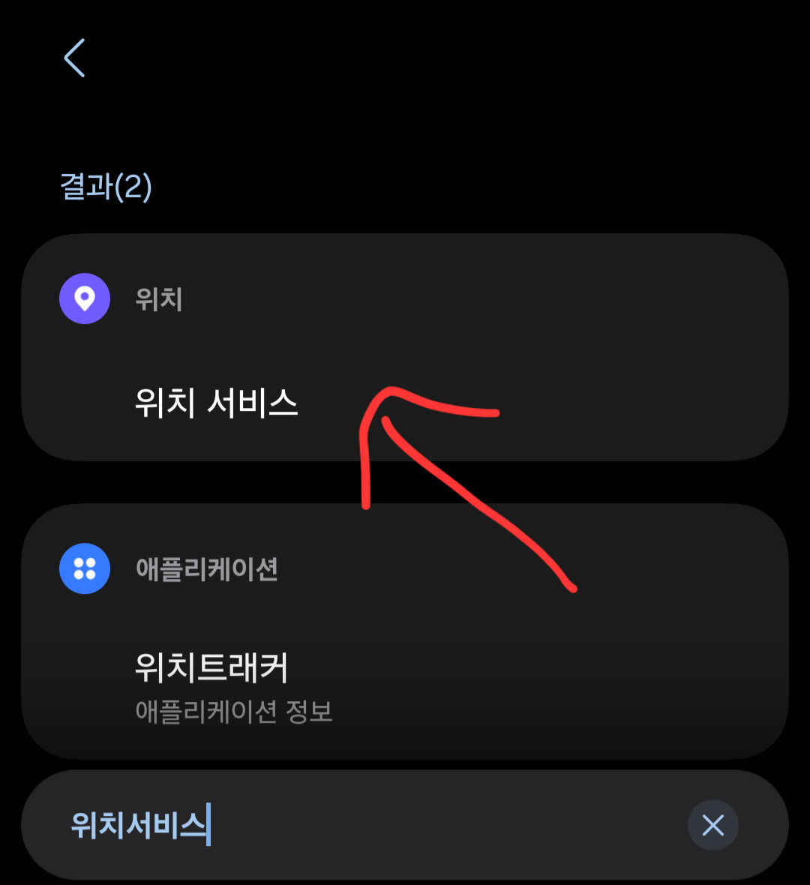
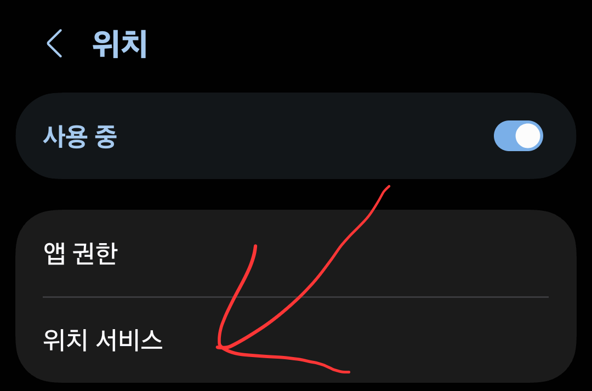
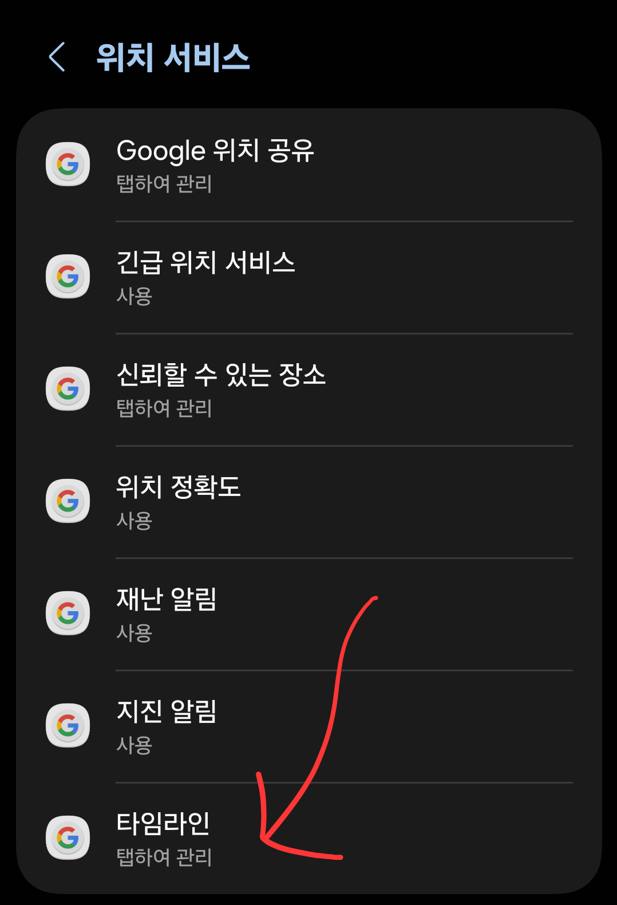
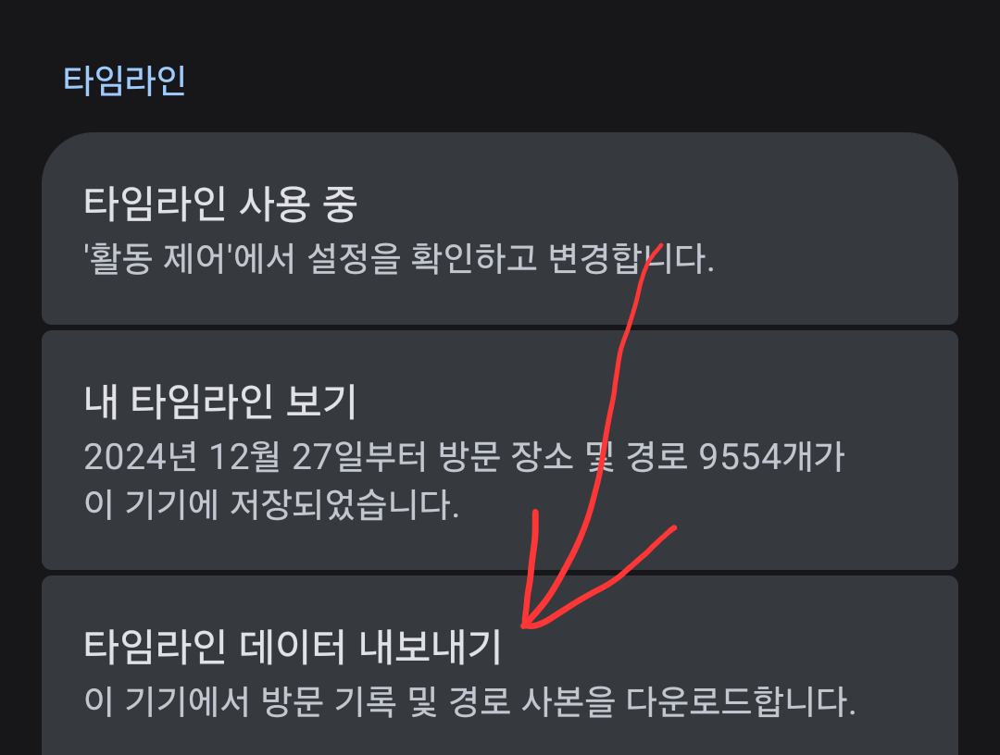
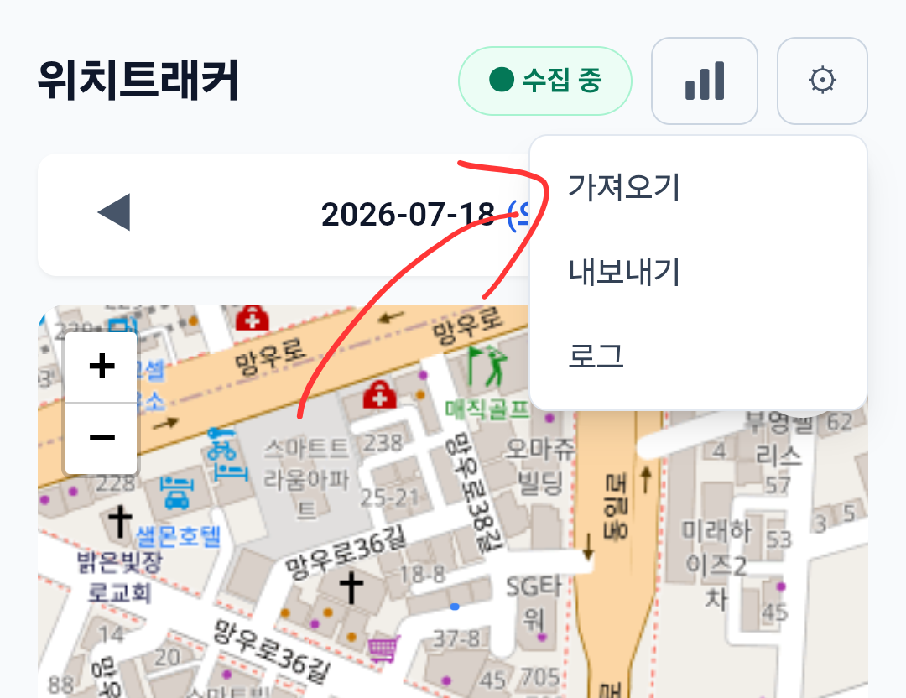
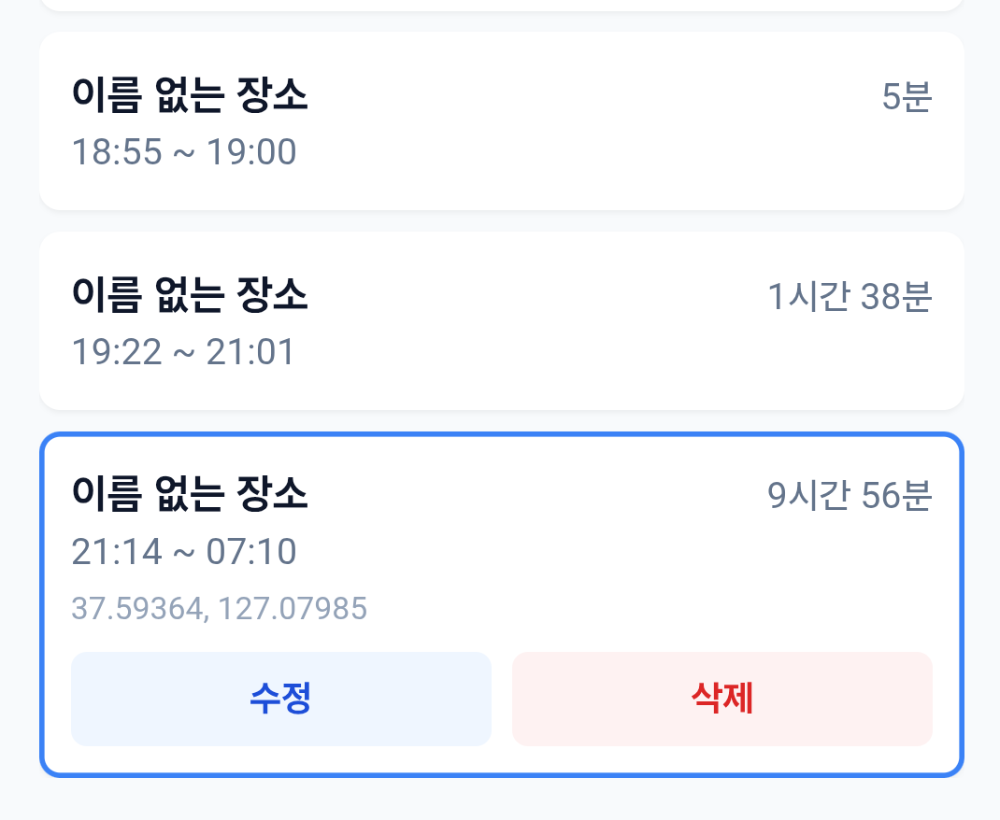

# 구글 타임라인 정보 갖고오기 가이드
> 구글 지도에서 제공해주는 타임라인 정보를 가져오는 가이드입니다. (설정시 내 이전 위치 정보를 가져올 수 있습니다.)

## 1. 설정 => "위치 서비스" 검색

  

## 2. "위치 서비스" 클릭

  

## 3. "타임라인" 클릭

  

## 4. 구글 계정 선택

> (구글 지도 어플에 로그인 되어있는 계정으로 선택)

## 5. 타임라인 데이터 내보내기

> "타임라인.json" 이 저장된다면 성공

  

## 6. 어플에서 타임라인 데이터 가져오기

> 저장한 "타임라인.json" 을 가져온다면 성공!

  

## 7. "이름 없는 장소" 이름 설정

> 가져온 타임라인 장소의 이름을 설정해주면 끝!(같은 장소는 1번만 설정해줘도 됨) 

  

